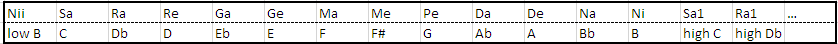
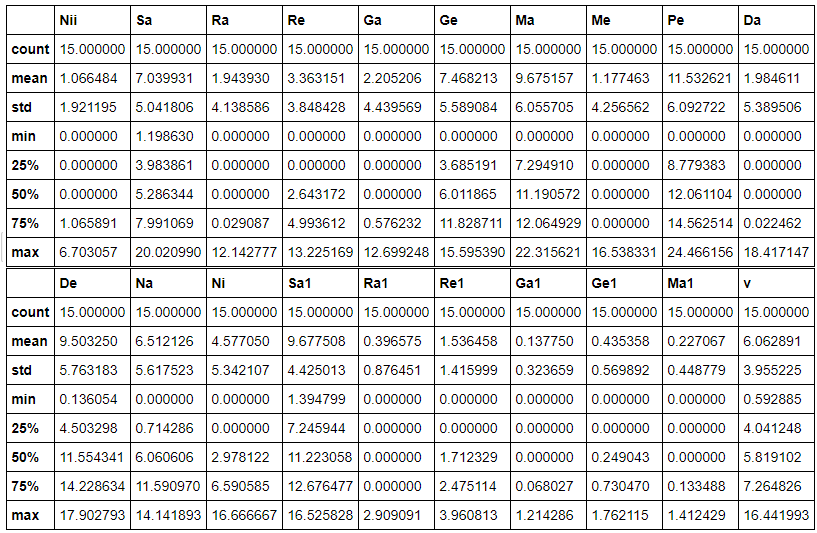
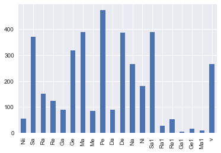
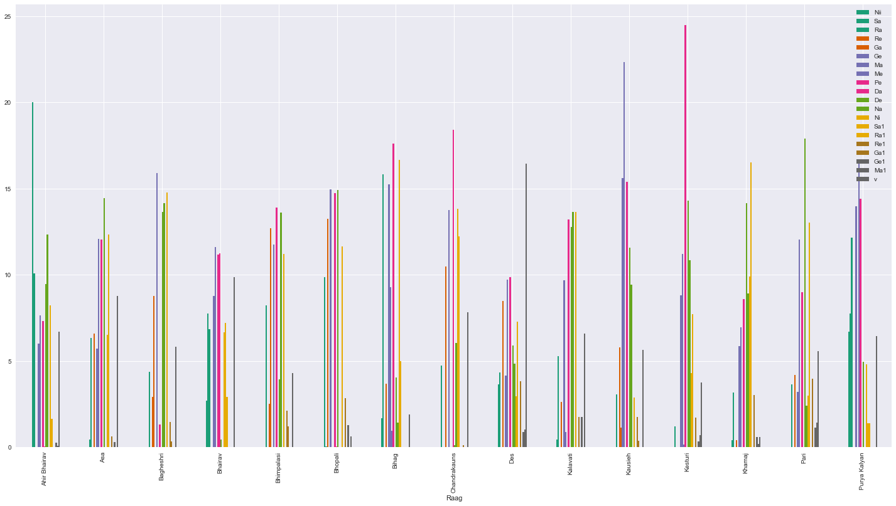
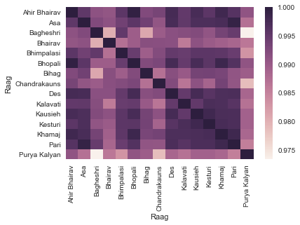
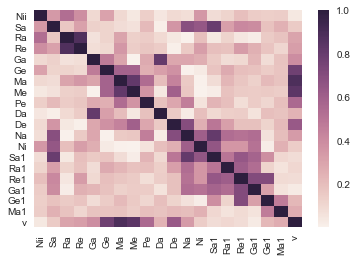

# Milestone 2

## Data Gathering

The dataset considered in this project comes mostly from a document written by Prof. John Baily, Goldsmith University. It is a collection of Afghan classical instrument compositions to be played on the instrument rubab and other instruments, which was prepared to serve a teaching material for the 2014 Winter School of the Afghan National Institute of Music, Kabul.  We are still waiting for an answer from him to see whether he would accept to extend the size of the present dataset with further material of his own, unavailable by other means. However some more data is  available at the moment, but not yet integrated into our dataset by lack of time. This addition includes self-made transcription of compositions taught by one of the few left exponent of this music, Ustad Daud Khan Sadozai, and other compositions transcribed by Prof. Baily in several of his journal papers. This project being conducted by a single person, the limited available time in its dire scarcity was thought better devoted to tasks of the present milestone report.

Finally, if we were to receive additional data from Prof. Baily, they would be passed seamlessly into our pipeline. As such, it might be that this project does not lead to great results because of limited data; on the other hand it can be considered that its design would well scale up.

In the original document, the data comes as a pdf file with the compositions written down in tables,
notated according to the notation system in use in teaching practices in Afghanistan– that is, a modified version of the Indian Saregam relative scale notation, with only quarter or eight notes. This accounts for a canonical form of the compositions, which are in practice performed with much rhythmical variations (emphasized by the instrumental style) as well as melodic. Nonetheless, the canonical form is supposed to account for the fundamental features of the pieces.

The pieces come in several rythmic cycles, although most of them are set in king cycle of Hindustani classical music, in 16 beats (tintal). There are also pieces in 15 beats (pancham savari), 12 beats (jhaptal) and 10 beats (ektal), a fraction of rythmic cycles known in Hindustani music that does not account for the cycles used in folk music or vocal classical music.  

## Preprocessing

Different segmentations of the compositions are considered to import the data : the first is to import each composition in its totality contained in strings, the second is to import each movement of each composition contained in strings, finally the third is to import each measure of each movement of each composition, divided in matra (beat). This is specifically interesting considered the structure of these compositions around Hindustani talas (rythmic modes). Such levels of segmentation allows one to go from rougher to finer grained perspective. For the time being, we looked only at full compositions.

Afterwards, the pieces notated using the Saregam notation system can be processed as if they were notated in the standard Western system, as there is direct correspondence between the Western chromatic scale and the Afghan division of the octave, C being used as the tonic of the modal frame (corresponding to the note Sa).  Additionally, for easier parsing the low Ni note is refactored as Nii.

Little more need to be done in order to begin with the exploratory analysis of the dataset.

One strong drawback of our dataset is that it is rather small (43 compositions for ~5000 notes), and by far limited as to the number of raags it covers, considered the depth of the raga modal world. However, inasmuch as Afghan art is borrowing from Hindustani music, it is said to have its own modal identity, and not only that of a borrowed culture. In this identity, the main modes limit to a quite smaller subset., some which are not among North Indian raags.  Nevertheless, our data still lacks compositions in two major of these modes, Bairami and Pilo. Some are included in the data left to integrate in our pipeline, which will be done over the next days, and so this shortage will be partly covered.
Our data comes mostly from an individual source, and this could be seen as a potential bias. Given how this source is regarded as the specialist ethnomusicologist of the music we deal with, this uncertainty can reasonably be dismissed. Another bias which we identified is that a number of compositions in our dataset are themes composed specifically for the Afghan rubab, but by an Indian sitar player. We would assume this would create a bias against a proper specificity of Afghan music. However, this number is fairly small even in proportion to our dataset, as only 4 themes are concerned.

## Basic Statistics

Let us look at some distribution features of the notes (which are really the important variables to consider for us) computed over the full dataset.

 
 
 
Unsurprisingly we see the importance of Pe (the fifth), but more surprisingly (at least for us!) we see that the tonic has a smaller frequency of appearance than its higher octave version, or than the fourth and the sixth. On the plot, we clearly see how the distributions revolves around the fifth (and even builds to it), with a major importance for the tonic at both octave as well showing an expected tension between these poles.

The next plot shows the distribution of notes per single mode. We see how each mode appears quite different from the other, although a few look similar to each other. This comforts us in the idea that a classification task could be successful.

 

Looking at correlation between the pairs of note does not prove to be helpful : mostly, it highlights that notes in the high octave are highly correlated with their normal octave version, probably because if, say, Db is not found in a piece, then it is certain that the higher octave Db will not either.

However, it is interesting to look at the correlation of modes with each other. Unfortunately, they now appear closer to what we imagined, apart for a few (mostly Purya Kalyan, very different from other raags present in our dataset).

 

Finally, we look at neighboring notes aggregated from all compositions . As expected, we see a strong correlation pattern along the diagonal axis, since we know modal music to observe a form of continuity within its melodies (seldom do melodies jump from notes far apart). Interestingly, we also see a strong correlation between silences and certain notes, namely the third and fourth, and a strong correlation between the tonic and its upper octave and neighboring seventh). This actually illustrates a common stylistic practice to jump from Sa to Ni or Ne, to make up for the limitation of the instrument in the lower octave, and the aesthetic value of alternating the tonic and its higher octave.

  

## Subsequent steps

We will now continue to add to our dataset and craft new features around the melodic fabric, that which could not be done in time for this report, which will then be used for classification. For this task, we will try several methods, although a Random Forest approach sounds convenient. There is still terrain to explore in the data as well; clustering might be an interesting direction. It is yet difficult to assess whether a classification task would provide meaningful results on such small data, especially considered how part of it seems to be quite similar. Perhaps classification could then be used to serve a different purpose, or abandoned for better perspectives. In any case, we might defend that what will be done could be used in different, future settings,  as more data could be fed to improve its outcome. Within the scope of the present endeavor, it may well remain limited.
